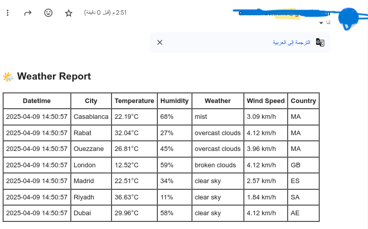
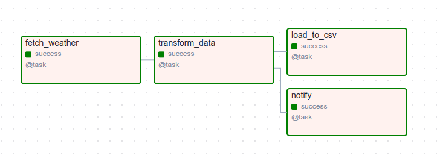

# **Airflow Weather Pipeline**

A weather data collection pipeline built using **Apache Airflow**, **Python**, and the **OpenWeatherMap API**.

This project automates the retrieval of weather data from multiple cities every 8 hours, stores it in a CSV file, and sends a summary email report. You can also use the collected data for **trend analysis in Power BI or Excel**.

---

## ✅ Project Features

- 🔁 Scheduled weather data collection (every 8 hours)
- 🌤️ Fetches real-time weather for a list of cities
- 📨 Sends an email summary with weather data in tabular format
- 💾 Stores the data in a CSV file (extensible to SQLite/PostgreSQL)
- 📊 Enables analysis and visualization via Power BI or Excel



---

## 📌 Goals

- Automate weather data fetching from **OpenWeatherMap API**
- Store weather data locally for analysis
- Send HTML-formatted weather reports by email
- Use **Power BI** or **Excel** for visual trend analysis (temperature, humidity, etc.)

---

## 🧱 Project Structure

```
weather_data_collector/
├── dags/
├── .env                         # Environment variables (API keys, emails, etc.)
│   └── weather_dag.py           # Main DAG to orchestrate tasks
├── data/
│   └── weather_data.csv         # Weather data collected and stored
└── requirements.txt             # Project dependencies
└── README.md 
```

---

## ⚙️ Technologies Used

- **Apache Airflow** – for workflow orchestration
- **Python** – core programming language
- **OpenWeatherMap API** – weather data source
- **Pandas** – data transformation and storage
- **SMTP (Gmail)** – for email notifications
- **Power BI / Excel** – for visualization and reporting

---

## 🔄 DAG Overview

| Task | Description |
|------|-------------|
| `fetch_weather` | Fetches current weather for all cities from the API |
| `transform_data` | Extracts and formats key fields (temperature, humidity, etc.) |
| `load_to_csv` | Appends the new data into a CSV file |
| `notify` | Sends an email report with the weather summary |

Scheduled using a cron expression: `0 */8 * * *` (every 8 hours).



---

## 🔒 Environment Variables (.env)

```env
OPEN_WEATHER_MAP_API_KEY='your_api_key'
CITIES_LIST=["Casablanca", "London", "Madrid", "Riad", "Dubai", "New York", "Tokyo"]
CSV_FILE_PATH='data/weather_data.csv'
RECIPIENT_EMAIL='receiver@example.com'
SENDER_EMAIL='sender@gmail.com'
SENDER_PASSWORD='your_password'
```

> ✅ Use **dotenv** to load these values securely into your Airflow DAG.

## 🚀 Get Started

1. Clone the repo and set up Airflow
2. Edit `.env` with your secrets
3. Run Airflow scheduler and webserver
4. Watch your DAG collect and email weather data!
